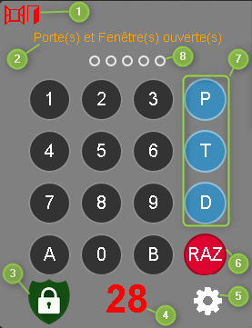

Description
===

Ce plugin permet d'afficher un digicode logiciel pour piloter une alarme.

Il inclut les fonctionnalités suivantes :

- Timer (configurable) avant activation de l'alarme
- Test des ouvrants avant activation
- Test de l'état de l'alarme avant activation
- Message sur état
- Blocage de la fonction retour du navigateur

Installation
===

### Pré-requis
Pour utiliser ce plugin il faut disposer des commandes suivantes :
- Etat de l'alarme de l'alarme
- Activation Totale de l'alarme
- Activation Partielle
- Désactivation de l'alarme

Configuration
===

## Configuration générale du plugin

Il n'y a aucune configuration générale pour ce plugin.

## Installation
Télécharger le plugin depuis le [Market](https://www.jeedom.com/market/index.php?v=d&p=market&type=plugin&&name=digicode) Jeedom

## Configuration
Une fois le plugin installé, il faut aller dans le menu Plugin -> Sécurité -> Digicode Plugin et créer un équipement.

Il faut ensuite donner les informations de votre alarme.

- 1 : La commande qui fournie le statut de l'alarme
- 2 : La commande qui active le mode Total
- 3 : La commande qui active le mode Partiel
- 4 : La commande qui déactive l'alarme
- 5 et 6 : Les commandes qui fournie le statut des ouvrants (virtuel généré par le résumé domotique)
- 7 : Délais d'activation
- 8 : Activation de l'état des ouvrants
- 9 : Inversion de l'état des ouvrants

### Création des utilisateurs
La création, la modification et la suppression des utilisateurs se fait directement depuis le widget en cliquant sur la roue crantée qui se situe en bas à droite.
Le code utilisateur est basé sur 4 chiffres
Le code maitre est basé sur 5 chiffres.

NB : cette icone est inaccessible lorsque l'arlame est activée.

Après avoir cliqué sur l'icone, une fenêtre s'ouvre et permet la gestion des comptes.

### Utilisation du widget

Le widget comporte plusieurs éléments :

- 1 : Etat des ouvrants
- 2 : Message
- 3 : Etat de l'alarme
- 4 : Compte à rebours
- 5 : Panneau pour la création des codes
- 6 : Effacement des chiffres rentrés
- 7 : Mode de l'Alarme
- 8 : Nombre de chiffre rentré

Pour activer ou désactiver l'alarme, il suffit de taper un code utilisateur (4 chiffres) + la lettre correspondante au mode d'alarme (P : mode partiel, T : mode totale, D : mode désactivé)
Pour activer ou désactiver le code maitre, il suffit de taper un code maitre (5 chiffres)

Changelog
===
### Version 1.0 (version market 2018-08-19 22:01:25)
- Verion initiale

### Version 1.1 (version market 2018-10-07 22:01:25)
- Ajout transparence sur design
- Ajout code maitre pour vérouiller la configuration du widget
- Ajout possibilité d'inverser l'état des ouvrants

### Version 1.2 (version market )
- Ajout d'une fonction permettant d'activer/désactiver le test des ouvrants
- Correction du comportement du widget (bug zoom)
- Ajout d'une fonction permettant d'actualiser le widget lors de l'activation de l'alarme hors plugin
- Amélioration de l'assistant de création des codes (code vide rejeté)
